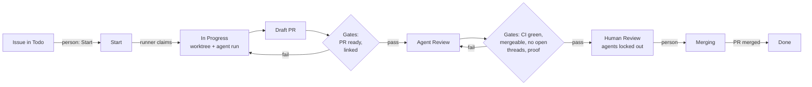

# Punchlist: Product Vision and v1 PRD

Oct 7, 2026 · @Gannon · Working name, draft v0.1

## Summary

Punchlist is an open-source issue tracker where coding agents do the work and the tracker enforces how the work gets done.

The issue is the unit of work. A runner on the team's own machine claims issues that are ready, runs Claude Code, Codex or Cursor in an isolated worktree, opens a pull request, and moves the issue through the team's workflow. The workflow is a versioned file that the tracker enforces: the statuses, who may move an issue between them, and the checks that must pass first. Today those rules live as prose in agent prompt files, and nothing enforces them.

The first release targets solo developers and small teams, 1 to 10 people, who already run several coding agents in parallel. Teams bring their own agents and subscriptions. The core is open source under MIT or Apache-2.0, at the user's choice, and self-hostable.

The first milestone is dogfooding: Groundwork's issues move from Linear to Punchlist, and Groundwork's agents ship from it.

## Vision

Every change ships from an issue, and every finished issue carries proof that it works.

**The problem.** Teams that run agent fleets bolt orchestration onto trackers built for people. The workflow rules live in prompt files such as `CLAUDE.md` and `AGENTS.md`: when an agent may start, who moves an issue to which status, what counts as merge-ready, and when an agent must stand down. Agents follow those rules most of the time. The tracker cannot enforce them, because it does not know which rule applies to whom or what state the pull request is in. Orchestrators that sit beside the tracker sync state in both directions, and the two drift apart.

Gannon's own setup shows the cost. About 90 lines of a global `CLAUDE.md` define nine statuses, a merge-ready rule and a stand-down column. Agents sign Linear comments with `(agent)` because they post through his account. Six orchestrators (Kata Code, Kata Agents, Kata Symphony, Factory, Agentis, Kata Orchestrator) were built to bridge the tracker and the agents.

**The belief.** When the tracker owns both the workflow and the run loop, rules become checks. An agent cannot move an issue past a gate whose check fails. It cannot act on an issue in a status that only humans own. Every transition records who made it, which checks ran and what they returned.

**Three years out.** Punchlist is the default open-source tracker for teams where agents write most of the code:

- Teams share and fork workflow files the way they share CI configs.
- Every finished issue carries its evidence: the pull request, CI results, review threads, and a verification run with screenshots and video.
- Groundwork links each issue to the customer problem behind it, so the path from customer quote to merged code is one chain of links.
- A hosted cloud runs managed runners for teams that do not want to host their own.

## Market and positioning

Trackers are putting agents on issues, and orchestrators are turning trackers into run queues. None of them enforces the workflow: the rules about who may move an issue, and what must be true first, still live in prompts.

| Product | What it does for agent development | Price | Where it stops |
| --- | --- | --- | --- |
| [Linear](https://linear.app/docs/coding-sessions) | Delegates an issue to an agent. Coding Sessions run Claude Code or Codex, draft a pull request and merge from Linear. Loops and triage automations. | Free; $10 Basic or $16 Business per user per month, yearly; sessions use AI credits | Closed. A person stays the assignee. Its docs describe no config-defined gates or per-transition permissions. |
| [GitHub Agent HQ](https://github.blog/news-insights/company-news/welcome-home-agents/) | Assigns and tracks Copilot, Claude and Codex in one place. Copilot cloud agent works Linear issues. | Paid Copilot plan | Closed. Gates live in branch rulesets, apart from the issue. Issues and Projects have no enforced states. |
| [Jira with Rovo](https://support.atlassian.com/jira-software-cloud/docs/what-is-the-jira-coding-agent/) | Agents in the assignee field. The Jira Coding Agent opens pull requests. Human checkpoints on workflow transitions. | Rovo credits; Rovo Dev Standard $20 per user per month | Closed and enterprise-priced. Gates are Jira workflow rules, not pull request, CI and proof. |
| [Plane](https://plane.so/blog/agents-are-now-live-in-plane) | Agents since Sep 2026: assign, mention, schedule or trigger on a status change. Bot users and MCP. | 100 to 200 agent credits per seat per month on paid plans | AGPL-3.0, about 60k stars. Coding and pull request agents not described. No enforced gates. |
| [Multica](https://github.com/multica-ai/multica) | Agents in the assignee field, squads, autopilots, 26 agent CLIs, several code hosts | Self-host free for internal use; cloud pricing unverified | Source-available license with hosting limits, about 52k stars, pre-1.0. Configurable states and gates undocumented. |
| [OpenAI Symphony](https://github.com/openai/symphony) | Watches a Linear board and starts a Codex run per issue. `WORKFLOW.md` config. Agents attach proof of work. | Free | Apache-2.0, about 27.6k stars. An engineering preview with no tracker. [Its spec](https://github.com/openai/symphony/blob/main/SPEC.md) enforces states, labels and concurrency and leaves gates to the agent. |
| [Sortie](https://pkg.go.dev/github.com/sortie-ai/sortie), [Composio Agent Orchestrator](https://github.com/ComposioHQ/agent-orchestrator), [Emdash](https://docs.emdash.sh/issues) | Run an agent per issue in a worktree, from Jira, GitHub or Linear issues | Free | Open source. No tracker of their own. Status columns are labels that block nothing. |
| [Devin](https://docs.devin.ai/integrations/linear), [Factory](https://factory.ai/industries/saas), [Cursor](https://cursor.com/product/jira) | Agents that take a Linear or Jira ticket and open a pull request | Paid | Closed. Agents only; no tracker or gates. |
| [AIDEN](https://aidenapp.org/issue-tracking-for-ai-agents), [It's a Plan](https://github.com/croffasia/itsaplan), [Beads](https://www.linuxlinks.com/beads-distributed-git-backed-graph-issue-tracker-ai-agents/) | Small agent-first trackers | Free or free tier | Single-player or pre-stable. AIDEN enforces a spec gate only. None gate on CI, review threads or proof. |

**The gap.** No product enforces CI green, resolved review threads, attached proof and person-only transitions together. No open-source product spans issue, pull request, verification and merge: the open-source orchestrators have no tracker, and the open-source trackers have no real gates.

**Positioning.** For small teams that ship with coding agents, Punchlist is the open-source issue tracker that dispatches the agents and enforces the workflow. Linear, Plane and Multica put agents on issues but leave the rules in prompts. Symphony-style orchestrators run agents beside a tracker and keep a second copy of issue state. Punchlist holds the issue, the workflow, the runs and the proof in one place, and it imports Symphony workflows.

**Stance toward incumbents.** Import from Linear once, then Punchlist is the source of truth. GitHub stays the code host. Agents are whatever the team already pays for: Punchlist dispatches Claude Code, Codex and Cursor and does not resell inference in v1.

## Users and jobs to be done

The primary user is a developer or tech lead on a team of 1 to 10 people who runs three or more coding agents in parallel, hosts code on GitHub, and tracks work in Linear or GitHub Issues today.

| Persona | Job to be done | Workaround today |
| --- | --- | --- |
| Solo founder-developer (primary) | Keep five agents busy on well-specified issues without starting each one by hand | Worktrees and tmux, a homegrown orchestrator, Linear plus prompt rules |
| Tech lead (primary) | Make agents follow the team's process: spec first, draft pull requests, stand down during human review | Long `CLAUDE.md` and `AGENTS.md` files; correcting agents by hand |
| Tech lead | Know which agent pull requests are ready for human review | Open every pull request; trust CI and bot reviews |
| Reviewer | Review a pull request with proof attached, not just a diff | Ask the agent for screenshots; run the branch locally |
| Product manager | See which customer problem an issue solves | Paste a link into the issue |

Small teams can switch trackers in an afternoon, which makes them the right first users. Teams leaving Linear at scale need cycles, roadmaps and notifications at parity, which is a later phase.

## Product principles

Seven principles decide trade-offs when the PRD is silent.

1. **The issue is the unit.** Every run, branch, pull request and piece of proof belongs to exactly one issue. One issue, one branch, one pull request.
2. **The workflow is code.** Statuses, transitions, roles and gates live in a versioned file, reviewed like code.
3. **Rules are checks, not prompts.** If a rule matters, the tracker enforces it. The agent prompt explains the rule; it does not carry it.
4. **Agents are actors.** Each agent has its own identity, role, token and audit trail. People and agents share one permission model with different roles.
5. **Bring your own agents.** Punchlist dispatches the agents and subscriptions a team already has, on the team's own hardware.
6. **Fast for people.** The web app is keyboard-first and responds instantly. Agents use the same API through MCP and a CLI.
7. **Open by default.** Licensed under MIT or Apache-2.0, self-hostable, no hosted dependency.

## How it works

The server holds issues, the workflow and the event log. Runners on the team's machines claim work. GitHub events and agent requests drive transitions, and the server checks every transition against the workflow file.



### Components

- **Server.** Web app, API and Postgres. Stores issues, the workflow, actors, runs and an append-only event log. Checks every transition.
- **Runner.** A daemon on the user's machine or dev server. It registers with the server and reports which agents and repositories it can run. It claims issues that the workflow allows it to dispatch, holding a lease it renews with a heartbeat. For each claim it creates a worktree on the issue's branch, starts the agent with the issue as the prompt and Punchlist's MCP server attached, and streams logs back. After a restart it resumes or fails each run it held, so no issue runs twice.
- **Agent interface.** An MCP server and the `pl` CLI. Agents read the issue, comment, attach proof and request transitions. The server answers a refused transition with the gate that failed and why.
- **GitHub App.** Webhooks for pull request opened, ready, merged and closed, check runs and review threads. These feed the gate checks and the automatic transitions that Linear's GitHub automation handles today.
- **Web app.** List and board views, and an issue page that shows the spec, runs, pull request, gate status, proof and timeline.

### The workflow file

The workflow is configuration that the server parses, validates and enforces, so it lives in a structured file. Prompts are prose that an agent reads, so they live in Markdown, one file per status that dispatches an agent. The split follows where Kata Symphony ended up after it outgrew a single `WORKFLOW.md`. See `docs/adr/0001-workflow-config-and-prompts.md`.

```text
.punchlist/
  workflow.toml        # statuses, transitions, gates, locks, dispatch
  prompts/
    system.md          # shared preamble for every run
    in_progress.md     # build the issue and open a draft pull request
    agent_review.md    # fix CI and answer review threads
```

This `workflow.toml` encodes Groundwork's lifecycle:

```toml
version = 1
statuses = ["backlog", "todo", "start", "in_progress", "agent_review",
            "human_review", "merging", "done", "canceled"]

[[transition]]
from = "backlog"
to = "todo"
by = ["person"]                  # approval

[[transition]]
from = "todo"
to = "start"
by = ["person"]                  # start signal

[[transition]]
from = "start"
to = "in_progress"
by = ["runner"]                  # a runner claims the issue

[[transition]]
from = "in_progress"
to = "agent_review"
by = ["agent"]
gates = ["pr_open", "pr_ready", "pr_names_issue"]

[[transition]]
from = "agent_review"
to = "human_review"
by = ["agent"]
gates = ["ci_green", "mergeable", "no_open_threads", "proof_attached"]

[[transition]]
from = "human_review"
to = "merging"
by = ["person"]

[[transition]]
from = "merging"
to = "done"
on = "pr_merged"

[[transition]]
from = ["in_progress", "agent_review"]
to = "todo"
on = "pr_closed_unmerged"
require = ["comment"]

[lock]
human_review = ["agent", "runner"]   # stand-down: agents cannot comment, push or be dispatched

[dispatch]
max_concurrent = 5

[dispatch.status.in_progress]
agent = "claude-code"
prompt = "prompts/in_progress.md"

[dispatch.status.agent_review]
agent = "codex"
prompt = "prompts/agent_review.md"
```

A status with a `dispatch.status` entry starts an agent with that prompt. A status without one waits for a person or a GitHub event, which is how a human gate is expressed.

v1 ships a fixed set of gates implemented in code. Each gate is a pure function over recorded evidence, such as check runs, review threads and proof records, so an agent cannot waive one by claiming it passed. Custom gates that run a command or call a webhook come later.

The server publishes a JSON Schema for `workflow.toml`, so editors with a TOML language server can complete and check it.

### Data model

| Entity | Holds |
| --- | --- |
| Workspace | Members, agents, runners, repositories, workflow |
| Issue | Title, body (spec and acceptance criteria), status, project, milestone, labels, parent, assignee |
| Actor | A person or an agent: role, token; for agents, kind (Claude Code, Codex, Cursor), model and owner |
| Workflow | A parsed, versioned workflow file: statuses, transitions, gates, locks, dispatch rules |
| Transition | From, to, actor, gate results, reason, time. Append-only; the latest one is the issue's status |
| Runner | Machine registration, capabilities, lease heartbeat |
| Run | Issue, runner, agent, worktree, branch, logs, tokens and cost when reported, outcome |
| Pull request | GitHub link, draft or ready, checks, review threads, merge state |
| Proof | Screenshots, video, scenario results or test output attached to an issue |
| Comment | Body, actor, thread |

## v1 PRD

v1 runs Groundwork's development for two weeks with no fallback to Linear: issues imported from Linear, agents dispatched by a runner on sartre, and the workflow file enforcing Groundwork's lifecycle.

### Problem

A developer running five agents spends the day starting runs by hand, checking which pull requests are really ready, and correcting agents that skipped a step of the process. The tracker records status but cannot tell a person from an agent or enforce what must be true before a status changes.

### Goals

- A Linear team's issues, projects, labels and comments import into a workspace in under 10 minutes.
- An issue moved to Start reaches a draft pull request with no prompt typed by a person.
- The server checks every transition against the workflow, and a refused transition names the gate that failed.
- Agents appear in the timeline as their own actors.
- No agent action lands on an issue in a status locked to people.
- A runner restart neither loses nor duplicates a run.

### Non-goals for v1

- Hosted sandboxes and managed runners
- Two-way Linear sync; Jira import
- Cycles, roadmaps, timelines and customer requests
- Mobile app
- Verification runs that Punchlist drives itself; v1 accepts proof that the agent attaches
- Custom gates
- Code hosts other than GitHub
- SSO and audit export

### Core flow

1. **Set up.** Create a workspace, install the GitHub App on the repositories, and import a Linear team.
2. **Define the workflow.** Start from a template and commit `.punchlist/workflow.toml` and its prompts.
3. **Register a runner.** Run `pl runner start` on a machine; it reports which agents it can run.
4. **Spec.** Write an issue with acceptance criteria, move it to Todo to approve it, then to Start.
5. **Dispatch.** A runner claims the issue, creates a worktree on the issue's branch and starts the agent.
6. **Build.** The agent opens a draft pull request. Logs stream to the issue page.
7. **Gate.** The agent requests Agent Review, then Human Review. Punchlist checks each request; the agent fixes CI and review threads until the gates pass.
8. **Review.** A person reviews the pull request, gates and proof on the issue page and moves it to Merging.
9. **Merge.** The pull request merges, and the issue moves to Done.

### Functional requirements

| ID | Requirement | Priority |
| --- | --- | --- |
| R1 | Issues: create and edit with a Markdown body, labels, project, milestone, parent and child, assignee (person or agent) | P0 |
| R2 | List and board views with keyboard navigation and filters | P0 |
| R3 | Parse, validate and version `workflow.toml` and its per-status prompts: statuses, transitions, roles, locks, dispatch rules; publish its JSON Schema | P0 |
| R4 | Gates: `pr_open`, `pr_ready`, `pr_names_issue`, `ci_green`, `mergeable`, `no_open_threads`, `proof_attached` | P0 |
| R5 | Transition API that checks roles, locks and gates in one transaction and returns the failing gate and reason | P0 |
| R6 | Append-only event log and timeline per issue | P0 |
| R7 | Separate identities, roles and API tokens for people and agents | P0 |
| R8 | Runner: register, heartbeat, claim with a lease, one worktree per issue, start Claude Code and Codex, stream logs, recover after restart | P0 |
| R9 | Runner support for the Cursor agent CLI | P1 |
| R10 | MCP server and `pl` CLI: read an issue, comment, attach proof, request a transition | P0 |
| R11 | GitHub App: link a pull request to its issue by branch name or ID; transition on draft opened, merged, and closed unmerged | P0 |
| R12 | Show the pull request's checks and review threads on the issue page | P1 |
| R13 | Linear import: issues, statuses mapped to workflow statuses, projects, milestones, labels, comments, parent and child | P0 |
| R14 | Issue page shows runs with logs, duration and reported cost, plus the pull request, gate status and proof | P0 |
| R15 | Upload proof (images, video, test reports) through MCP, CLI and the web app | P0 |
| R16 | Inbox for people: issues waiting in a person-owned status, refused transitions, failed runs | P1 |
| R17 | Projects and milestones with "PASS when" criteria | P1 |
| R18 | Concurrency limit per runner and agent; token or cost budget per run | P1 |
| R19 | Search across issues and comments | P1 |
| R20 | Docker Compose self-host: web app, worker, Postgres | P0 |
| R21 | Custom gates that run a command or call a webhook | P2 |
| R22 | Convert a Symphony `WORKFLOW.md` and its prompts into a Punchlist workflow | P2 |

### Non-functional requirements

- **Speed.** Lists and issue pages respond in under 100 ms after first load. The sync approach is an ADR.
- **Correctness.** A transition and its gate checks commit in one transaction. A claim is a lease. A run is idempotent per issue and attempt.
- **Security.** Repository credentials and agent subscriptions stay on the runner; the server never sees them. Agent tokens are scoped to one workspace and role. Text from outside the team, such as issue bodies and review comments, reaches an agent only inside a fence that the text cannot close, and branch names are screened for control characters.
- **Traceability.** Every transition stores the actor, the workflow version and each gate's result.
- **Stack.** Rust for everything behind the UI: the server, the runner, the `pl` CLI and the MCP server, in one Cargo workspace, with Postgres as the store. A pure core crate holds the workflow parser, gates and transition rules, and every other crate depends on it. The runner starts from Kata Symphony's orchestrator. See `docs/adr/0003-rust-backend.md`. The frontend is open: a web app in TypeScript, or a native GPUI client.

### What carries over from earlier projects

Kata Symphony, Factory, Kata Code and Agentis wind down. Their code is mostly a reference to port ideas from, because only Kata Symphony is mature and it is written in Rust.

| Part | Source | Use |
| --- | --- | --- |
| Orchestrator loop: claim, run, retry with capped backoff, reconcile, detect stalls | Kata Symphony `apps/symphony/src/orchestrator.rs` (v2.3.3, about 1,150 tests) | Candidate v1 runner behind a Punchlist tracker adapter (its `TrackerAdapter` trait has five methods) |
| Prompts and agent choice per status | Kata Symphony `.symphony/prompts/`, `prompts.by_state`, `model_by_state` | Port the idea into `dispatch.status` |
| Worktree per issue, lifecycle hooks, path safety | Kata Symphony `workspace.rs`, `path_safety.rs` | Port; copy `path_safety` as is |
| Gate computed from evidence; verifier cannot waive a failing criterion | Kata Symphony `src/verification/gate.rs`, ADRs 0001 to 0006 | Model for R4 and phase 3 |
| Durable attempts, lease fencing with compare-and-set, never auto-retry an unknown effect | Kata Symphony ADRs 0002 and 0005; Agentis `run-lifecycle.ts` and ADR 0001 | Model for R8 recovery |
| Rework rounds: continue the open pull request or start fresh | Factory `server/rounds.ts`, ADRs 0009 and 0012 | Port the idea |
| Untrusted-text fencing for issue and comment content | Factory `server/rounds.ts`, `server/linear.ts`, ADR 0012 | Port as is |
| Linear and GitHub Projects readers | Kata Symphony `apps/cli/src/backends/` (TypeScript) | Starting point for the R13 importer |
| Signed, deduplicated webhook ingress with leases | Kata Code `apps/server/src/routines/` | Model for R11 |
| Digest-bound action approvals | Agentis `packages/cli/src/store.ts` | Later: approvals for risky agent actions |

## Success metrics

All targets are hypotheses to revisit after the dogfood phase.

| Metric | Target | Phase |
| --- | --- | --- |
| Consecutive days Groundwork runs from Punchlist with no fallback to Linear | 14 | Gate 1: dogfood |
| Groundwork pull requests that start from a runner dispatch | 80% or more | Gate 1: dogfood |
| Agent actions on issues in a status locked to people | 0 | All |
| Runs lost or duplicated across runner restarts | 0 | All |
| Design-partner teams running it weekly without help | 5 | 2: design partners |
| Weekly active workspaces, 90 days after launch | 50 | 4: launch |

## Roadmap

Punchlist is the second product, and Groundwork's Gate 1 comes first. Months assume work starts in mid-October 2026.

| Phase | Timing | Scope | Exit criteria |
| --- | --- | --- | --- |
| Gate 0. Spec, stack and prototype | Oct 2026 | This PRD; ADRs for the workflow format, license, backend, frontend and sync; a spike that builds the issue list both in GPUI and on the web; three prototype variants each for the issue list and the issue page | Frontend chosen, a prototype variant chosen, and Gate 1 sliced in Linear |
| Gate 1. Dogfood | Nov to Dec 2026 | P0 requirements | Groundwork's and Punchlist's own issues run from Punchlist for 14 days |
| Phase 2. Design partners | Jan to Feb 2027 | P1 requirements; five small teams | Five teams run it weekly without help |
| Phase 3. Verified pull requests | Mar to Apr 2027 | Punchlist runs the issue's verification scenarios on `main` and the branch and attaches screenshots and video; `proof_attached` becomes `proof_verified` | Every dogfood pull request carries a Punchlist-run verification |
| Phase 4. Launch and cloud | Q2 2027 | Public repository and docs; hosted cloud with managed runners; Groundwork links issues to customer evidence | Launch metrics tracking toward 90-day targets |
| Phase 5. Team scale | H2 2027 | Cycles, roadmaps, notifications, SSO, Jira import | Decide after phase 4 |

## Business model

The hosted cloud earns the revenue once it exists. Self-hosting stays free and complete.

**Licensing.** Dual-licensed under MIT or Apache-2.0, the Rust ecosystem's convention, with no contributor license agreement. See `docs/adr/0002-dual-license.md`.

**Pricing.** Pricing waits for the design-partner phase. The working hypothesis is a per-workspace price for hosting, with managed runners metered by compute time. Agent inference stays on the team's own subscriptions. For reference, Linear costs $10 (Basic) or $16 (Business) per user per month billed yearly, and its agent sessions draw on AI credits. Plane meters agents by credits per seat.

## Risks and open questions

The largest risk is Linear. It owns the issue data, already merges agent pull requests from Coding Sessions, and is the tracker Symphony targets. Among open-source projects, Multica and Plane have the largest followings and are the likeliest to add gates.

| Risk | Mitigation |
| --- | --- |
| Linear or GitHub adds enforced gates and per-transition permissions | Stay open source and self-hosted with bring-your-own agents; ship the workflow file and gates first |
| Multica or Plane adds enforced gates | Ship gates first; a permissive license against Plane's AGPL and Multica's hosting limits; import Symphony workflows |
| Open-source orchestrators struggle to sustain themselves: Vibe Kanban shut down in April 2026 and Terragon in January 2026 | Plan the hosted cloud as the revenue source; prove the tool on Groundwork, so it pays for itself in Gannon's own work either way |
| Teams will not switch trackers | Target small teams; import from Linear in minutes; prove it on Groundwork |
| Tracker parity has no end | Hold the non-goals; keep P0 to the agent loop |
| Agent CLIs change flags, auth or terms for headless use | One adapter per agent; pin CLI versions; the runner checks capabilities at startup |
| Agents run with shell and repository write access | They run on the team's hardware in a worktree per issue; sandboxing with devbox is an option |
| One founder, two products | Groundwork's Gate 1 first; Punchlist runs Groundwork, so work on one tests the other |

### Open questions

- [x] Runner language? Rust, starting from Kata Symphony's orchestrator, decided Oct 7, 2026 (ADR 0003).
- [ ] Frontend: a web app in TypeScript, React and Vite served by the Rust server, or a native GPUI client using GPUI Kit, with its WebAssembly build for links? A Gate 0 spike builds the issue list both ways and measures speed, load size, accessibility, and whether agents and Playwright can build and drive it.
- [x] Markdown or structured config for the workflow? Structured config plus Markdown prompts per status, decided Oct 7, 2026.
- [x] TOML or YAML? TOML, decided Oct 7, 2026 (ADR 0001).
- [x] License? MIT or Apache-2.0, decided Oct 7, 2026 (ADR 0002).
- [ ] Sync approach for an instant UI: a sync engine, or server state with optimistic updates?
- [ ] Does the workflow file live in the code repository or in the workspace, for teams with several repositories?
- [ ] One repository per workspace in v1, or several?
- [ ] Merge from Punchlist, or leave merging on GitHub?
- [ ] Trademark and domain check for the name; punchlist.com is a design-feedback product.

## Sources

Some pricing and capability details come from vendor or third-party pages and were not verified independently.

- [Linear: Coding Sessions](https://linear.app/docs/coding-sessions)
- [Linear: Agents in Linear](https://linear.app/docs/agents-in-linear.md)
- [Linear: Pricing](https://linear.app/pricing)
- [GitHub: Welcome home, agents (Agent HQ)](https://github.blog/news-insights/company-news/welcome-home-agents/)
- [GitHub changelog: Copilot cloud agent for Linear is generally available, Jul 2026](https://github.blog/changelog/2026-07-23-copilot-cloud-agent-for-linear-is-now-generally-available/)
- [Atlassian: What is the Jira Coding Agent](https://support.atlassian.com/jira-software-cloud/docs/what-is-the-jira-coding-agent/)
- [Atlassian: How billing works for Rovo Dev Standard](https://support.atlassian.com/subscriptions-and-billing/docs/how-billing-works-for-rovo-dev-standard)
- [Plane: Agents are now live in Plane](https://plane.so/blog/agents-are-now-live-in-plane)
- [Plane on GitHub](https://github.com/makeplane/plane)
- [Multica on GitHub](https://github.com/multica-ai/multica)
- [OpenAI Symphony](https://github.com/openai/symphony) and [its spec](https://github.com/openai/symphony/blob/main/SPEC.md)
- [Help Net Security: OpenAI Symphony, Apr 2026](https://www.helpnetsecurity.com/2026/04/28/openai-symphony-codex-orchestration-linear/)
- [Sortie](https://pkg.go.dev/github.com/sortie-ai/sortie)
- [Composio Agent Orchestrator](https://github.com/ComposioHQ/agent-orchestrator)
- [Emdash: Issues](https://docs.emdash.sh/issues)
- [Vibe Kanban](https://github.com/BloopAI/vibe-kanban) and [its shutdown notice](https://vibekanban.com/blog/shutdown)
- [Terragon OSS](https://github.com/terragon-labs/terragon-oss)
- [Devin: Linear integration](https://docs.devin.ai/integrations/linear)
- [Factory](https://factory.ai/industries/saas)
- [Cursor for Jira](https://cursor.com/product/jira)
- [AIDEN](https://aidenapp.org/issue-tracking-for-ai-agents)
- [It's a Plan](https://github.com/croffasia/itsaplan)
- [Beads](https://www.linuxlinks.com/beads-distributed-git-backed-graph-issue-tracker-ai-agents/)
